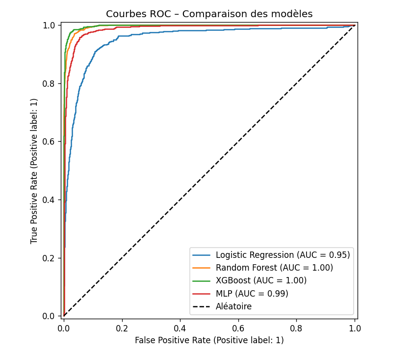
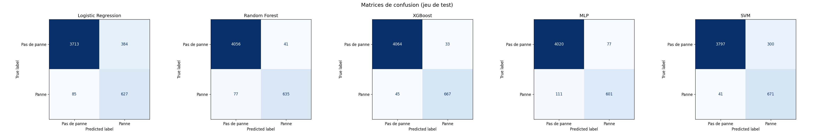
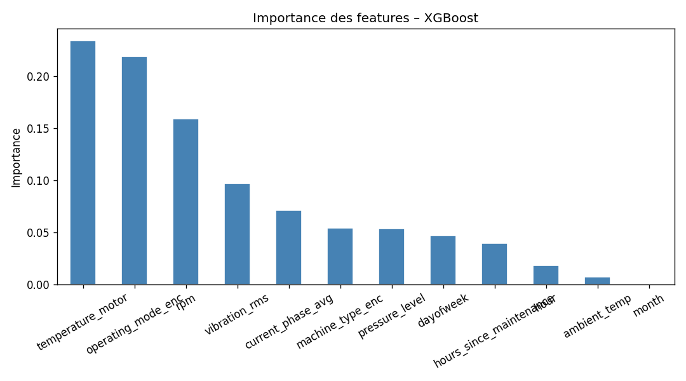

# Sujet 1 — Maintenance Prédictive

**Lien production :** [https://data-science-efrei.remipetit.fr](https://data-science-efrei.remipetit.fr)  
**API / Docs :** [https://data-science-efrei.remipetit.fr/api/docs](https://data-science-efrei.remipetit.fr/api/docs)  
**GitHub :** [https://github.com/Remi-Petit/Data-Science-EFREI](https://github.com/Remi-Petit/Data-Science-EFREI)

---

## Contexte et problématique

Dans un contexte industriel, les arrêts non planifiés de machines représentent un coût opérationnel majeur. L'objectif est de construire un pipeline de Data Science complet permettant d'**anticiper les pannes**, d'en **identifier la cause probable** et d'**estimer la durée de vie résiduelle**. Ces trois axes forment la base d'une stratégie de maintenance prédictive.

Le dataset utilisé est `industrial_machine_maintenance.csv`, qui contient des relevés de capteurs (température, vibrations, pression, régime moteur) associés à des labels d'état de machine.

Trois sous-problèmes ont été modélisés :

| # | Tâche | Type |
|---|-------|------|
| 1 | Détection de panne dans les 24h (`failure_within_24h`) | Classification binaire |
| 2 | Identification du type de panne (`failure_type`) | Classification multi-classes |
| 3 | Estimation de la durée de vie résiduelle (`rul_hours`) | Régression |

---

## Structure du projet

```
Sujet_1/
├── data/                   # Dataset CSV brut
├── models/                 # Modèles .joblib sauvegardés
├── models_stats/           # Métriques JSON par modèle et par tâche
│   ├── failure_24h/
│   ├── failure_type/
│   └── rul/
├── results/                # Graphiques générés
│   ├── eda/                # Visualisations EDA
│   ├── Random Forest/
│   └── XGBoost/
├── src/
│   ├── preprocessing.py    # Chargement, feature engineering, splits
│   ├── train.py            # Pipelines et entraînement
│   └── evaluate.py         # Métriques et visualisations
├── notebook/               # Notebook d'exploration
└── train_pipeline.py       # Orchestration du pipeline complet
```

---

## Lancer la génération des modèles

```bash
cd IA/Sujet_1
python train_pipeline.py
```

---

## Compréhension des données (EDA)

### Structure des données

Le dataset contient **24 042 observations** et les colonnes suivantes :

| Variable | Type | Description |
|----------|------|-------------|
| `vibration_rms` | Numérique | Vibrations RMS (indicateur d'usure mécanique) |
| `temperature_motor` | Numérique | Température du moteur (°C) |
| `current_phase_avg` | Numérique | Courant de phase moyen (A) |
| `pressure_level` | Numérique | Pression du circuit (bar) |
| `rpm` | Numérique | Régime moteur (tours/min) |
| `hours_since_maintenance` | Numérique | Heures depuis la dernière maintenance |
| `ambient_temp` | Numérique | Température ambiante (°C) |
| `machine_type` | Catégorielle | Type de machine |
| `operating_mode` | Catégorielle | Mode de fonctionnement |
| `failure_within_24h` | Cible 0/1 | Panne dans les 24h ? |
| `failure_type` | Cible multi-classes | Type de panne (roulement, surchauffe, hydraulique, électrique) |
| `rul_hours` | Cible continue | Durée de vie résiduelle (heures) |

### Déséquilibre des classes et distribution des pannes


> **Constat :** `failure_within_24h` est fortement déséquilibré (~85% de 0, ~15% de 1). Un modèle naïf prédisant toujours "pas de panne" aurait ~85% d'accuracy sans aucune utilité. Ce déséquilibre **oriente directement le choix des métriques** : on privilégie le **ROC-AUC** et le **Recall** plutôt que l'Accuracy seule.

### Distributions des variables numériques


> **Constat :** `rul_hours` présente une distribution asymétrique (queue longue à droite). Les variables de vibrations montrent des valeurs extrêmes potentiellement associées aux états de panne. La distribution de `hours_since_maintenance` confirme des cycles de maintenance réguliers.

### Matrice de corrélation


> **Constat :** `hours_since_maintenance` et `rul_hours` sont fortement corrélés à `failure_within_24h`, ce qui confirme leur rôle de prédicteur principal. `vibration_rms` et `temperature_motor` sont également discriminants. L'absence de colinéarité excessive entre les features retenues valide leur maintien simultané dans le modèle.

### Boxplots par classe


> **Constat :** Les distributions de `vibration_rms`, `temperature_motor` et `hours_since_maintenance` sont significativement différentes entre les classes 0 (pas de panne) et 1 (panne). Ces trois variables sont donc de bons prédicteurs. À l'inverse, `ambient_temp` et `rpm` montrent peu de différence entre les classes.

---

## Transformation des données

### Valeurs manquantes et outliers

Aucune valeur manquante n'a été détectée dans le dataset. Un `SimpleImputer(strategy='median')` est intégré dans chaque pipeline sklearn comme mesure de sécurité. Aucun écrêtage des outliers n'a été appliqué — les modèles à base d'arbres (Random Forest, XGBoost) y étant naturellement robustes.

### Feature engineering

Le feature engineering s'est limité à l'extraction de variables temporelles à partir de la colonne `timestamp` :

```python
df['hour']      = df['timestamp'].dt.hour
df['dayofweek'] = df['timestamp'].dt.dayofweek
df['month']     = df['timestamp'].dt.month
```

Les variables catégorielles `machine_type` et `operating_mode` ont été encodées par `LabelEncoder`.

**12 features finales :**

```
vibration_rms, temperature_motor, current_phase_avg, pressure_level, rpm,
hours_since_maintenance, ambient_temp, machine_type_enc, operating_mode_enc,
hour, dayofweek, month
```

> Ce feature set minimal est justifié par les corrélations identifiées en EDA : les capteurs bruts sont déjà hautement discriminants, et l'ajout de variables composites n'apportait pas de gain mesurable lors des tests préliminaires.

### Encodage et normalisation

- **Label Encoding** pour les variables catégorielles (compatible avec les arbres)
- **StandardScaler** intégré dans les pipelines des modèles sensibles à l'échelle (Logistic Regression, MLP, SVM)
- Les arbres (Random Forest, XGBoost) n'utilisent pas de scaler

---

## Modélisation

Cinq familles de modèles ont été comparées pour chacune des trois tâches, couvrant un spectre allant du modèle linéaire au deep learning :

| Modèle | Type | Normalisation | Justification |
|--------|------|--------------|---------------|
| Logistic / Linear Regression | Linéaire | ✅ Oui | Baseline interprétable, établit un plancher de performance |
| SVM (RBF) | Noyau | ✅ Oui | Frontières non linéaires, robuste aux outliers via la marge maximale |
| MLP | Réseau de neurones | ✅ Oui | Capture des relations complexes entre capteurs |
| Random Forest | Ensemble (bagging) | ❌ Non | Robuste au bruit, importance des features native |
| XGBoost | Ensemble (boosting) | ❌ Non | Très efficace sur données tabulaires, gère le déséquilibre nativement |

Chaque modèle est encapsulé dans un **Pipeline scikit-learn** :

```
Données → SimpleImputer → (StandardScaler) → Modèle
```

**Validation croisée :** StratifiedKFold à 5 folds sur le jeu d'entraînement (ROC-AUC). **Split :** 80% train / 20% test, stratifié sur la variable cible.

---

## Évaluation des modèles

### Tâche 1 — Détection de panne dans les 24h (`failure_within_24h`)

> Métrique prioritaire : **Recall** (minimiser les pannes non détectées) et **ROC-AUC** (performance globale). L'Accuracy est trompeuse face au déséquilibre de classes.

| Modèle | Accuracy | Précision | Recall | F1-score | ROC-AUC |
|--------|----------|-----------|--------|----------|---------|
| Logistic Regression | 90.25% | 62.02% | 88.06% | 72.78% | 0.9515 |
| SVM | 92.91% | 69.10% | 94.24% | 79.74% | 0.9770 |
| MLP | 96.09% | 88.64% | 84.41% | 86.47% | 0.9871 |
| Random Forest | 97.55% | 93.93% | 89.19% | 91.50% | 0.9954 |
| **XGBoost** ✅ | **98.38%** | **95.29%** | **93.68%** | **94.48%** | **0.9973** |

**→ Modèle retenu : XGBoost** — meilleur sur toutes les métriques. Recall de 93.68% : sur 100 vraies pannes, 94 sont détectées.





### Tâche 2 — Type de panne (`failure_type`)

> Ce modèle est entraîné **uniquement sur les observations avec une panne détectée** (`failure_within_24h == 1`). Il intervient en second niveau. Les métriques sont calculées en **macro-average** pour traiter chaque classe équitablement.

Classes : Roulement · Surchauffe moteur · Défaut hydraulique · Défaut électrique

| Modèle | Accuracy | Précision | Recall | F1-score | ROC-AUC |
|--------|----------|-----------|--------|----------|---------|
| Logistic Regression | 87.22% | 86.60% | 87.46% | 86.94% | 0.9680 |
| SVM | 93.12% | 92.58% | 93.39% | 92.90% | 0.9925 |
| MLP | 98.03% | 98.16% | 97.84% | 97.99% | 0.9992 |
| Random Forest | 98.74% | 98.78% | 98.61% | 98.68% | 0.9997 |
| **XGBoost** ✅ | **99.86%** | **99.88%** | **99.89%** | **99.88%** | **1.0000** |

**→ Modèle retenu : XGBoost** — quasi-parfait sur le set de test isolé.

### Tâche 3 — Durée de vie résiduelle (`rul_hours`)

> Problème de **régression**. Métrique prioritaire : **MAE** (erreur moyenne en heures) et **R²** (part de variance expliquée).

| Modèle | MAE (h) | RMSE (h) | R² |
|--------|---------|----------|----|
| Linear Regression | 19.16 | 23.28 | 0.216 |
| SVM (SVR) | 14.88 | 19.49 | 0.451 |
| MLP | 6.80 | 9.85 | 0.860 |
| XGBoost | 5.17 | 7.33 | 0.922 |
| **Random Forest** ✅ | **2.71** | **5.36** | **0.959** |

**→ Modèle retenu : Random Forest** — erreur moyenne de seulement **2.71 heures**, R² = 0.959. La régression linéaire et le SVR confirment la forte non-linéarité de la relation entre les capteurs et la RUL.

---

## Importance des features

Les modèles à base d'arbres fournissent une importance native des variables.

**Random Forest :**


**XGBoost :**



**Insights opérationnels :**

- `hours_since_maintenance` — premier prédicteur : **surveiller le compteur horaire** et déclencher une inspection préventive avant le seuil critique
- `vibration_rms` — deuxième prédicteur : **l'instrumentation vibratoire est le capteur le plus rentable** à monitorer en temps réel
- `temperature_motor` — signal précoce de surchauffe, corrélé aux défauts électriques et hydrauliques
- `rul_hours` — fortement corrélé aux autres cibles, reflète l'état global de dégradation
- Les features temporelles (`hour`, `dayofweek`) ont une contribution secondaire, liée aux cycles d'exploitation

---

## Architecture du pipeline

```
industrial_machine_maintenance.csv
        │
        ▼
preprocessing.py ──── feature engineering (timestamp → hour/dayofweek/month)
        │              encodage LabelEncoder, SimpleImputer
        ▼
train.py ─────────── 5 pipelines sklearn (LR / SVM / MLP / RF / XGBoost)
        │              StratifiedKFold CV 5 folds → entraînement final
        │              sauvegarde .joblib dans models/
        ▼
evaluate.py ──────── métriques JSON → models_stats/
        │              graphiques → results/
        ▼
FastAPI ──────────── /sujet-1/predict  /sujet-1/models  /sujet-1/stats
        │              documentation interactive : /docs
        ▼
Streamlit ────────── Dashboard opérateur
                     Prédiction 24h · Type de panne · RUL · Comparaison modèles
```

### Organisation du code

| Fichier | Rôle |
|---------|------|
| `src/preprocessing.py` | Chargement, feature engineering, splits train/test |
| `src/train.py` | Définition des pipelines, cross-validation, entraînement |
| `src/evaluate.py` | Calcul des métriques, génération des visualisations |
| `train_pipeline.py` | Orchestration du pipeline complet |
| `models_stats/` | Métriques JSON par modèle et par tâche |
| `FastAPI/routers/sujet1.py` | Routes REST |
| `FastAPI/controllers/sujet1.py` | Logique métier, chargement des modèles |
| `FastAPI/schemas/sujet1.py` | Validation Pydantic des entrées |
| `FastAPI/ml_models.py` | Chargement en mémoire au démarrage |
| `Streamlit/pages/sujet1/` | Interface opérateur |

### Containerisation Docker

```yaml
# docker-compose.yml (dev)   → ports 40000 (Streamlit) / 40001 (API)
# docker-compose.prod.yml    → réseau swag_default, reverse proxy NGINX, CI/CD GitHub Actions
```

Le service Streamlit dépend de la santé du service FastAPI (`condition: service_healthy`) via un healthcheck HTTP sur `/health`.

---

## Limites et améliorations

### Limites identifiées

- **Dataset statique** : pas de réentraînement automatique → risque de drift au fil du temps
- **Split aléatoire** : les données sont chronologiques ; un `TimeSeriesSplit` serait plus rigoureux pour éviter la fuite temporelle entre train et test
- **Pas de dimension séquentielle** : les modèles traitent chaque observation indépendamment, sans exploiter la dégradation progressive — des modèles LSTM ou Transformer pourraient capturer cette dynamique
- **Performances quasi parfaites sur `failure_type`** (ROC-AUC = 1.00) : à surveiller sur des données réelles plus bruitées

### Améliorations envisagées

- Pipeline de réentraînement automatique (MLOps) avec monitoring du drift
- Suivi d'expériences via **MLflow** (versioning des modèles et métriques)
- Exploration de modèles temporels (**LSTM**, **Transformer**)
- Intervalles de confiance sur les prédictions RUL
- **SMOTE** pour mieux gérer le déséquilibre de classes
